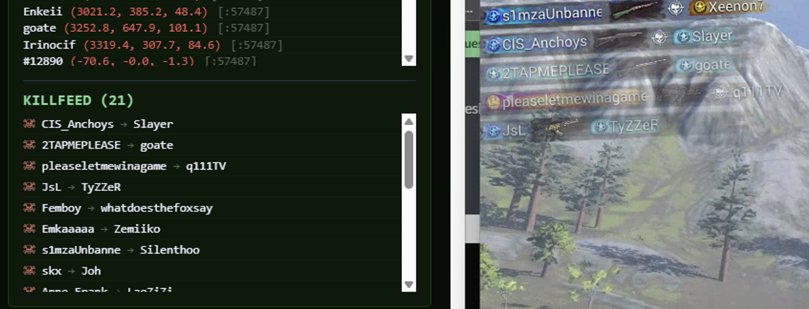

# H1Z1 / ROTK, Network Passive Read PoC


> [!WARNING]
> Projet de recherche uniquement. Pas conçu pour une utilisation en jeu réel. Usage à vos risques et périls, ban potentiel, risques légaux selon votre juridiction.

> [!NOTE]
> Le rapport complet (`assets/RAPPORT.md`) a été envoyé à l'équipe **ROTK**. Ils sont informés de la technique de lecture réseau passive décrite ici et peuvent aviser en conséquence.

> [!TIP]
> **Pourquoi ce projet existe, comment ça marche, pourquoi les anti-cheat classiques sont aveugles face à ça** → tout est dans [`RAPPORT.md`](./assets/RAPPORT.md). Commencez par là si vous voulez comprendre avant de toucher au code.

<br>

## Objectif

Projet fait **pour la science** : comprendre le protocole SOE UDP, documenter la faille de conception et illustrer pourquoi un anti-cheat purement côté processus ne peut pas détecter ce type d'outil.

Tout se passe 100% côté réseau :

| Ce que l'outil fait | Ce que l'outil ne fait PAS |
|---|---|
| Capture le trafic UDP entrant | Injection de code |
| Déchiffre RC4 (clé extraite du trafic) | Lecture mémoire processus |
| Parse les paquets applicatifs | Patch binaire / DLL injection / hook |
| Push les events en temps réel | Modifier le client de quelque façon que ce soit |

C'est techniquement le même principe que Wireshark avec un plugin de déchiffrement RC4 par-dessus.

<br>

## Ce que ça démontre

### ✅ Killfeed (PoC validé)

Extraction en temps réel du nom du tueur et de la victime directement depuis le trafic UDP chiffré, sans toucher au processus du jeu.

C'est la **preuve principale de la faille** : la lecture réseau passive suffit pour extraire des informations de jeu en temps réel.



> *Screenshot basé sur un ancien design de l'interface.*

### 🚧 Radar (WIP)

La partie radar (extraction des positions et affichage sur carte) n'est pas encore opérationnelle. Manque de temps pour continuer à creuser le parsing des paquets de position. La base est là (`h1z1_position_parser.py`, `Services/PositionParser.cs`) mais l'intégration n'est pas terminée.

<br>

## Structure du projet

Le projet principal est dans `/RadarPoC` : app C# ASP.NET Core qui orchestre la capture live, le déchiffrement SOE, le parsing et le push temps réel vers le front via SignalR.

Les scripts dans `/python` sont là pour la **compréhension** : ils isolent chaque étape de façon lisible et standalone, utiles pour débugger ou comprendre le protocole sans avoir à compiler du C#.

```
h1z1-network-cheat/
│
├── assets/                              # Rapport + screenshots
│   ├── RAPPORT.md                       # Analyse technique complète
│   └── killfeed.png                     # Capture killfeed en action
│
├── python/                              # Scripts standalone, compréhension & debug
│   ├── sniffer_by_process.py            # Capture UDP filtrée par process H1Z1
│   ├── sniffer_tshark_by_process.py     # Variante tshark
│   ├── soe_reassembly.py                # Réassemblage + déchiffrement RC4 SOE
│   ├── killfeed_parser.py               # Parser killfeed (opcode zone 0x02)
│   ├── h1z1_position_parser.py          # Parser positions
│   ├── replay_pcap.py                   # Replay d'un .pcap pour debug
│   └── dump_analyze.py                  # Analyse de dumps bruts
│
└── RadarPoC/                            # ★ Projet principal, ASP.NET Core + React
    ├── Services/
    │   ├── PacketCaptureService.cs       # Capture live (SharpPcap), orchestration
    │   ├── SoeStream.cs                  # Déchiffrement RC4 + réassemblage SOE
    │   ├── Rc4.cs                        # Implémentation RC4
    │   ├── PositionParser.cs             # Parser positions joueurs
    │   └── SpawnParser.cs               # Parser spawns
    ├── Hubs/
    │   └── RadarHub.cs                   # SignalR, push temps réel vers le front
    ├── Models/
    │   └── PlayerPosition.cs             # Modèle position joueur
    ├── ClientApp/                        # Front end
    ├── appsettings.json
    └── Program.cs
```

<br>

## État & roadmap

Le front React (`RadarPoC/ClientApp/`) affiche le killfeed et les positions en temps réel. Stack : React + Vite + Tailwind CSS v4, design aligné sur la charte ROTK. Pas de tests, c'est un PoC.

- [ ] Intégration front radar (affichage des positions sur carte)
- [ ] Packaging / distribution (Npcap, config réseau, installeur)
- [ ] Reconnexion SignalR propre
- [ ] Interface utilisable sans avoir à toucher au code

<br>

## Utilisation

> Prérequis : [Npcap](https://npcap.com/) installé en mode WinPcap, .NET 8 SDK, Node.js.

**Ordre de lancement obligatoire :**

1. **Lancer RadarPoC**, dans `/RadarPoC` :
   ```
   dotnet run
   ```
   Interface React sur `http://localhost:3000`. Badge : *"Connecté, en attente du jeu"*.

2. **Lancer le launcher ROTK** normalement.

3. **Lancer H1Z1 via le launcher**. Le process est détecté automatiquement, capture UDP démarre. Badge passe à *"Process H1Z1 détecté, capture active"*.

Rejoindre une partie : le killfeed s'alimente en temps réel.

<br>

## Prérequis

| Dépendance | Usage |
|---|---|
| [Npcap](https://npcap.com/) (mode WinPcap) | Capture réseau |
| .NET 8 SDK | RadarPoC C# |
| Python 3.10+ + `scapy` + `pycryptodome` | Scripts Python |
| H1Z1 / ROTK | Lancé sur la même machine |

<br>

## Rapport technique

[`RAPPORT.md`](./assets/RAPPORT.md) couvre :
- Protocole SOE UDP et mécanique de réassemblage
- Double vulnérabilité RC4 (clé statique dans le binaire + clé de session en clair dans le trafic)
- Format binaire complet du paquet killfeed
- Pourquoi les anti-cheat basés processus (EAC, BattlEye) sont aveugles à cette technique
- Pistes de mitigation côté serveur
